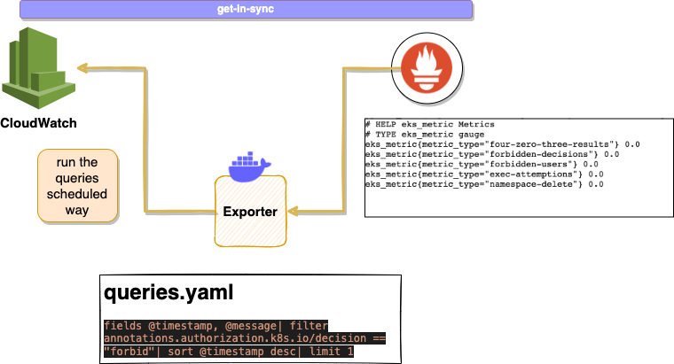

[](https://app.travis-ci.com/WoodProgrammer/soprano)

# Soprano - Log based alert generator

</img>

Soprano is a metric generator according to the output of the cloudwatch Insight queries results.
It collects the outputs from AWS CLoudwatch Insights.

Let's check the overall architecture diagram at below;

</img>

Soprano expose an endpoint for the prometheus, with that way you are able to expose log based metrics according to the your queries.

Example metric output;

```
eks_audit_metric{audit_metric_type="exec-attemptions"} 2.0
eks_audit_metric{audit_metric_type="forbidden-decisions"} 1.0
eks_audit_metric{audit_metric_type="forbidden-users"} 1.0
eks_audit_metric{audit_metric_type="four-zero-three-results"} 3.0
```

## Deployment and Configuration
Soprano allows you to 
define your custom queries like that if you want to run and fetch different kind of queries you can set them like that;

```yaml
queries:
    forbidden-decisions : fields @timestamp, @message| filter annotations.authorization.k8s.io/decision == "forbid"| sort @timestamp desc| limit 1
    forbidden-users : fields @timestamp, @message| filter user.username == "forbid"| sort @timestamp desc| limit 1
    exec-attemptions : fields @timestamp, @message| filter objectRef.subresource == "exec"| sort @timestamp desc| limit 1
```

These are example queries but you can set own queries in the `values.yaml` file, to adjust the <b>queries</b> variable.

### How to Deploy

Soprano helm chart is located under the deploy/soprano directory and you are able to deploy it like that 

```
    helm upgrade -i [RELEASE-NAME] ./deploy/soprano  
```

You can populate the helm chart values like that.

### Caveats:

* Soprano does not creates any prometheus rules for the alerting purposes you can set your prometheus rules according to the your query definitions.

* You can use soprano via aws EC2 IAM Profile but in kubernetes side you are able to annotate your service Account to  access AWS via well defined Roles.

- Example Role Definition:
```
{
  "Version": "2012-10-17",
  "Statement": [
      {
        "Sid": "LogGroupRetention",
        "Effect": "Allow",
        "Action": [
            "logs:Get*",
            "logs:Describe*",
            "logs:StartQuery",
            "logs:StopQuery",
            "logs:GetQueryResults",
            "cloudwathc:Get*"
        ]
        "Resource": "arn:aws:logs:REGION:ACCOUNT_ID:log-group:LOG-GROUP-NAME"
      }
  ]
}
```

### Helm Chart Values Table:


## Configuration

The following table lists the configurable parameters of the Cloudwatch Exporter chart and their default values.

| Parameter                         | Description                                                             | Default                     |
| --------------------------------- | ----------------------------------------------------------------------- | --------------------------- |
| `image.repository`                | Image                                                                   | `emirozbir/soprano
| `eks.region`                | The aws region where you are working                                                                    | `eu-west-1
| `eks.log_group_name`                | Log group address to work on                                                                    | `/aws/eks/test-cluster/cluster
| `notification.webhook_url`                | The Slack webhook URL                                                                    | ``
| `notification.send_to_slack`                | Send slack message or not                                                                    | `TRUE|FALSE
| `servicemonitor.prometheus_release_name`                |  Release name of the kube-prometheus stack                                                                     | `eu-west-1
| `servicemonitor.namespace`                | Prometheus operator namespace on                                                                   | `eu-west-1
| `exporter.port`                | Exposed port value on                                                                   | `9877
| `serviceAccount.annotations`                | Annocations for the IRSA usage or generic purpose staff on                                                                   | `eks.amazonaws.com/role-arn: arn:aws:iam::ACCOUNT_ID:role/ROLE-FOR-SOPRANO"


# TODO
* Helm Operator for the loki (on premise usage)
* ElasticSearch and Humio Support